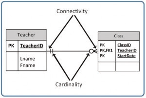
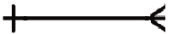

# Relational Database Design from Maryland

:LiNotebook: Most of this material is adopted from **Database Design - 2nd Edition** book

##  What you need to know

Before you can design a Relational Database, you need to understand a little more about its primary components.  You can use this page as a reference for all of the terms used in this course.

**Table or Relation:**  A Table in Relational Database is simpler to a table in Word or another word processor.  It is a simple list of data.  It has a name.  It can have multiple Columns, which in Relational Databases can also be called Fields or Attributes.  For example, you could have a table called Customer.

**Column, Field or Attribute:**  A Column makes up tables.  It has a name and a Datatype.  For example, a table called Customer might have columns named Name, Phone, and Balance.

**Datatype:**  Each Column has a datatype describing what data types can be stored in the column.  This could include letters, integers, and decimals.  In many cases, datatypes also describe the size of the data that can be stored.

**Row or Record:**  This is a single collection of data for a table.  It has values for each of the columns.  For example, a table called Customer might have a record with Name = “Bill Smith”, Phone = “123-456-7890” and a Balance = 150.55.  A table can have multiple rows.  Some databases have millions of rows.

**Primary Key:**  A primary key is one or more columns in a table that cannot have the same values repeated within rows.  It is often used to reference a specific row.  When you shop in stores you often see a product number on a product.  This is a primary key.  Their system might very well have a table in a database called Product.  There could be a column called ProductNo that is a primary key.  An example of a primary key with more than one field could be a table of classrooms on a college campus.  A table could be called Classroom, with columns Building and RoomNo.  Multiple classrooms have the same Building name, and multiple classrooms have the same room number.  But each Building and RoomNo together identify a unique classroom.

**Index:**  An index can be defined on one or more fields on a table to make retrieving data on that column(s) faster.  Have you ever contacted a company, and they tell you what data they can use to bring up your account?  They might say, “I can look up your account on the account # and phone number?”  That probably means that their system has an index on the account # and another index on the phone number.

**Foreign Key:**  A Foreign Key is when a Primary Key of one table is a column in another table.  This defines a relationship between the two tables.  For example, let us assume that I have a table Customer that has a primary key of CustomerNo.  It stored information about my customers.  But I have another table called Sales that has a primary key of SalesNo.  But who do I know which sales were made by which customers?  In the Sales table, I will put a column called CustomerNo.  If customer number 1 is “Bill Smith” and sales number 55 is an iPhone, but the customer number in the Sales table is 1, then I know that Bill Smith purchased that iPhone.  Foreign Keys are how we link different types of data across a database.

There are a few other components in relational databases, but this list is probably enough to understand how to create database designs.

## Physical and Logical Models

All database diagrams can be classified as Logical or Physical diagrams.  Logical diagrams attempt to explain the system (in this case, the database) in concepts and non-technically.  Physical diagrams show a design that matches how it will be implemented, in this case, a Relational Database.

They are intended for different audiences. Logical diagrams are:
- normally for less technical people
- produced earlier in the process

While physical diagrams are:
- very technical in nature
- produced once the conceptual view is decided upon

Let's look at an example.  Assume that we are building an accounting system.  During the design process, we want to review the database model with one of the users, an Accountant.  This is often done to make sure everything is correct before building.  One part of our model might say, AccountName Varchar (20).  You show this to the Accountant, and he is confused.  Why is there no space between "Account" and "Name"?  What is Varchar(20)?  People that build databases know that a table name cannot have a space in it and that Varchar(20) is a string field that can hold up to 20 characters.  But the Accountant knows none of this.  This can cause so much confusion that the entire review session with the Accountant can be sidetracked.

But what is the model said, Account Name String up to 20 characters.   This is a logical design.  This can reduce confusion.  Then, after reviews are completed, a physical diagram can be created from the logical diagram.

## Schema Diagram

A Schema Diagram is a basic diagram showing the tables and columns.  A Schema Diagram is a list of the tables in a database.  For each table, there is a horizontal bar with the attribute names.  No data types are provided, but we normally use the exact syntax for the attribute name (i.e., not spaces in the names). We often underline the attributes that make up the primary key.

Here is an example

Customers

| customer_id | customer_name |
| ----------- | ------------- |

Orders

| order_id | customer_id | order_date |
| -------- | ----------- | ---------- |

Shipments

| shipment_id | order_id | shipment_date |
| ----------- | -------- | ------------- |

This diagram shows that there will be a table called Customers.  It will have 2 attributes.  Customer_id is the primary key.  Customer_name is the second attribute.  Then there is a table for Orders.  It has 3 attributes:  Order_id (the primary key), customer_id and order_date.  The final table is Shipments.  It has 3 attributes:  shipment_id (the primary key), order_id and shipment_date.

### Schema Diagram with Foreign Keys

Referential integrity constraints are rules that the database enforces so that data does not get messed up.

We can add our referential integrity constraints to the diagram by showing where the foreign keys will be.  This is shown by arrow points from the attribute that has the foreign key to the attribute of where possible values can come from.

## Basics

If user requests you to create the database for an application, identify the major nouns of each sentences

Ask yourself
- Is this an entity?
  - What is Entity: A major collection of data
- Is this an attribute (i.e. characteristics) of an entity?
  - ask a question _has a_ Eg. has a book have title, has a book have price
- Is this a value for an attribute of an entity?

**Cardinality** : In database, is the count of elements in a relationship between entities
Eg. 1-to-1, 1-to-many, many-to-many
Eg for each
1. Bank account and bank transactions is 1-to-many
2. students to classes - many-to-many
3. In multiple player video game - level to player is 1-to-many
4. Baby to Parents is 1-to-2

## Entity Relationship Model

The entity relationship (ER) data model has existed for over 35 years. It is well suited to data modelling for use with databases because it is fairly abstract and is easy to discuss and explain. ER models are readily translated to relations. ER models, also called an ER schema, are represented by ER diagrams.

ER modelling is based on two concepts:
- Entities, defined as tables that hold specific information (data)
- Relationships, defined as the associations or interactions between entities

Here is an example of how these two concepts might be combined in an ER data model: Prof. Ba (entity) teaches (relationship) the Database Systems course (entity).

For the rest of this chapter, we will use a sample database called the COMPANY database to illustrate the concepts of the ER model. This database contains information about employees, departments and projects. Important points to note

include:
- There are several departments in the company. Each department has a unique identification, a name, location of the office and a particular employee who manages the department.
- A department controls a number of projects, each of which has a unique name, a unique number and a budget.
- Each employee has a name, identification number, address, salary and birthdate. An employee is assigned to one department but can join in several projects. We need to record the start date of the employee in each project. We also need to know the direct supervisor of each employee.
- We want to keep track of the dependents for each employee. Each dependent has a name, birthdate and relationship with the employee.

### Entity, Entity Set and Entity Type

An entity is an object in the real world with an independent existence that can be differentiated from other objects. An entity might be

- An object with physical existence (e.g., a lecturer, a student, a car)
- An object with conceptual existence (e.g., a course, a job, a position)

They are tables in relational databases.

**Representing a Tables in an ERD**
Tables are represented as rectangles in ERDs.  The table has 1 horizontal line.  Above the line is the name of the tables.  Below the line are the columns in the table.  Here is an example.  The table name is animals.  This table will have columns for Name, Age and Health. (I intentionally left out the image)

**Representing a Column in an ERD**
As shown before, columns are rows of the table below the main horizontal line.  Often we note the columns that make up a Primary Key with a PK beside them.  In some cases, we draw a second horizontal line separating the primary key columns from the other columns.  For each column, we place the column name and then the datatype.  If there are any constraints, we note them after the datatype.   In the example above Name is of varchar(20), and the column cannot be null.

### Entity Relationship

Next, we can design the relationships between entities.  This is normally done through foreign keys.  We can document the cardinality between tables.

The cardinality of Entity Relationships
Business rules are used to determine cardinality and connectivity. Cardinality describes the relationship between two data tables by expressing the minimum and a maximum number of entity occurrences associated with one occurrence of a related entity. In the following figure, you can see that cardinality is represented by the innermost markings on the relationship symbol. In this figure, the cardinality is 0 (zero) on the right and 1 (one) on the left.

Figure Position of connectivity and cardinality on a relationship symbol, by A. Watt.

The outermost symbol of the relationship symbol, on the other hand, represents the connectivity between the two tables. Connectivity is the relationship between two tables, e.g., one-to-one or one-to-many. The only time it is zero is when the FK can be null. When it comes to participation, there are three options to the relationship between these entities: either 0 (zero), 1 (one) or many. In the figure above, for example, the connectivity is 1 (one) on the outer, left-hand side of this line and many on the outer, right-hand side.

This figure shows the symbol that represents a one-to-many relationship.

In this figure, both inner (representing cardinality) and outer (representing connectivity) markers are shown. The left side of this symbol is read as minimum 1 and maximum 1. On the right side, it is read as: minimum 1 and maximum many.

### Relationship Types

The line that connects two tables in an ERD indicates the relationship type between the tables: either identifying or non-identifying. An identifying relationship will have a solid line (where the PK contains the FK). A non-identifying relationship is indicated by a broken line and does not contain the FK in the PK.

Optional relationships
In an optional relationship, the FK can be null, or the parent table does not need to have a corresponding child table occurrence. The symbol, shown in Figure 9.6, illustrates one type with a zero and three prongs (indicating many) which is interpreted as zero OR many.

For example, if you look at the Order table on the right-hand side of the figure above, you’ll notice that a customer doesn’t need to place an order to be a customer. In other words, the many sides is optional.

The relationship symbol in the figure can also be read as follows:

- Left side: The ordering entity must contain a minimum of one related entity in the Customer table and a maximum of one related entity.
- Right side: A customer can place a minimum of zero orders or a maximum of many orders.

Note: Image are left intentionally

### Mandatory Relationship Types

In a mandatory relationship, one entity occurrence requires a corresponding entity occurrence. The symbol for this relationship shows one and only one, as shown in Figure 9.10. The one side is mandatory.

So far, we have seen that the innermost side of a relationship symbol (on the left side of the symbol) can have a 0 (zero) cardinality and connectivity of many (shown on the right side of the symbol) or one (not shown).

However, it cannot have connectivity of 0 (zero), as displayed in this figure. The connectivity can only be 1.

## 1st and 2nd Normal Form

### Normal Form Background

Normalization should be part of the database design process. However, it isn't easy to separate the normalization process from the ER modelling process, so the two techniques should be used concurrently.

Use an entity relation diagram (ERD) to provide the big picture, or macro view, of an organization’s data requirements and operations. This is created through an iterative process that involves identifying relevant entities, their attributes and their relationships.

The normalization procedure focuses on the characteristics of specific entities and represents the micro view of entities within the ERD.

### Defining Normal Form

Normalization is the branch of the relational theory that provides design insights. It is the process of determining how much redundancy exists in a table. The goals of normalization are to:
- Be able to characterize the level of redundancy in a relational schema
- Provide mechanisms for transforming schemas in order to remove redundancy
Normalization theory draws heavily on the theory of functional dependencies. Normalization theory defines six normal forms (NF). Each normal form involves a set of dependency properties that a schema must satisfy and each normal form gives guarantees about the presence and/or absence of update anomalies. This means that higher normal forms have less redundancy, and as a result, fewer update problems.

### Normal Form Overview

All the tables in any database can be in one of the normal forms we will discuss next.  Ideally, we only want minimal redundancy for PK to FK. Everything else should be derived from other tables.  There are six normal forms, but we will only look in detail at the first four, which are:

- First normal form (1NF)
- Second normal form (2NF)
- Third normal form (3NF)
- Boyce-Codd normal form (BCNF)

BCNF is rarely used.

There is a 4th and 5th Normal Forms, but these are seldom used.  So, we will cover them but not go into too much detail. Additionally, few people use 1st and 2nd Normal Forms, but you need to understand them in order to understand the 3rd Normal Form and BCNF.

#### 1st Normal Form

In the first normal form, only single values are permitted at the intersection of each row and column; hence, there are no repeating groups.

To normalize a relation that contains a repeating group, remove the repeating group and form two new relations.

The PK of the new relation is a combination of the PK of the original relation plus an attribute from the newly created relation for unique identification.

**Process for 1st Normal Form**

We will use the Student_Grade_Report table below, from a School database, as our example to explain the process for 1NF.

Table: Student_Grade_Report

| StudentNo | StudentName  | Major     | CourseNo | CourseName    | InstructorNo | InstructorName | InstructorLocation | Grade |
| --------- | ------------ | --------- | -------- | ------------- | ------------ | -------------- | ------------------ | ----- |
| 123       | Salley Smith | Chemistry | CHM 101  | Intro to Chm. | 456          | Dr. Brown      | Old Main, Rm 100   | A     |

- In the Student Grade Report table, the repeating group is the course information. A student can take many courses.
- Remove the repeating group. In this case, it’s the course information for each student.
- Identify the PK for your new table.
- The PK must uniquely identify the attribute value (StudentNo and CourseNo).
- After removing all the attributes related to the course and student, you are left with the student course table (StudentCourse).
- The Student table (Student) is now in first normal form with the repeating group removed.

The two new tables are shown below.

Table: Student

| <u>StudentNo</u> | StudentName  | Major     |
| ---------------- | ------------ | --------- |
| 123              | Salley Smith | Chemistry |

Table: StudentCourse

| <u>StudentNo</u> | <u>CourseNo</u> | CourseName    | InstructorNo | InstructorName | InstructorLocation | Grade |
| ---------------- | --------------- | ------------- | ------------ | -------------- | ------------------ | ----- |
| 123              | CHM 101         | Intro to Chm. | 123          | Dr. Brown      | Old Main, Rm 100   | A     |

**How to update 1NF anomalies**
StudentCourse (StudentNo, CourseNo, CourseName, InstructorNo, InstructorName, InstructorLocation, Grade)

- To add a new course, we need a student.
- When course information needs to be updated, we may have inconsistencies.
- To delete a student, we might also delete critical information about a course.

#### 2nd Normal Form

For the second normal form, the relation must first be in 1NF. The relation is automatically in 2NF if, and only if, the PK comprises a single attribute.

If the relation has a composite PK, then each non-key attribute must be fully dependent on the entire PK and not on a subset of the PK (i.e., there must be no partial dependency or augmentation).

**Process for 2nd Normal Form Example**

To move to 2NF, a table must first be in 1NF.

- The Student table is already in 2NF because it has a single-column PK.
- When examining the Student Course table, we see that not all the attributes are fully dependent on the PK, specifically all course information. The only attribute that is fully dependent is grade.
- Identify the new table that contains the course information.
- Identify the PK for the new table.
- The three new tables are shown below.

Table: Student

| <u>StudentNo</u> | StudentName  | Major     |
| ---------------- | ------------ | --------- |
| 123              | Salley Smith | Chemistry |

Table: CourseGrade

| <u>StudentNo</u> | <u>CourseNo</u> | Grade |
| ---------------- | --------------- | ----- |
| 123              | CHM 101         | A     |

Table: CourseInstructor

| <u>CourseNo</u> | CourseName    | InstructorNo | InstructorName | InstructorLocation |
| --------------- | ------------- | ------------ | -------------- | ------------------ |
| CHM 101         | Intro to Chm. | 123          | Dr. Brown      | Old Main, Rm 10    |

**How to update 2NF anomalies**

- When adding a new instructor, we need a course.
- Updating course information could lead to inconsistencies for instructor information.
- Deleting a course may also delete instructor information.

#### 3rd Normal Form

To be in the third normal form, the relation must be in the second normal form. Also, all transitive dependencies must be removed; a non-key attribute may not be functionally dependent on another non-key attribute.

**Process for 3rd Normal Form Example**

- Eliminate all dependent attributes in the transitive relationship(s) from each of the tables that have a transitive relationship.
- Create a new table(s) with removed dependency.
- Check new table(s) as well as the table(s) modified to make sure that each table has a determinant and that no table contains - inappropriate dependencies.

See the four new tables below.

Table: Student

| <u>StudentNo</u> | StudentName  | Major     |
| ---------------- | ------------ | --------- |
| 123              | Salley Smith | Chemistry |

Table: CourseGrade

| <u>StudentNo</u> | <u>CourseNo</u> | Grade |
| ---------------- | --------------- | ----- |
| 123              | CHM 101         | A     |

Table: Course

| <u>CourseNo</u> | CourseName    | InstructorNo |
| --------------- | ------------- | ------------ |
| CHM 101         | Intro to Chm. | 123          |

Table: CourseInstructor

| <u>InstructorNo</u> | InstructorName | InstructorLocation |
| ------------------- | -------------- | ------------------ |
| 123                 | Dr. Brown      | Old Main, Rm 100   |

At this stage, there should be no anomalies in the third normal form. Let’s look at the dependency diagram (Figure 1) for this example. The first step is to remove repeating groups, as discussed above.

Student (StudentNo, StudentName, Major)

StudentCourse (StudentNo, CourseNo, CourseName, InstructorNo, InstructorName, InstructorLocation, Grade)

To recap the normalization process for the School database, review the dependencies shown in Figure 1.

The abbreviations used in Figure 1 are as follows:

- PD: partial dependency
- TD:  transitive dependency
- FD:  full dependency (Note: FD typically stands for functional dependency.)

#### Boyce-Codd Normal Form (BCNF)

When a table has more than one candidate key, anomalies may result even though the relation is in 3NF. Boyce-Codd's normal form is a special case of 3NF. A relation is in BCNF if, and only if, every determinant is a candidate key.

**BCNF Example 1**

Consider the following table (St_Maj_Adv).

| Student_id | Major   | Advisor |
| ---------- | ------- | ------- |
| 111        | Physics | Smith   |
| 111        | Music   | Chan    |
| 320        | Math    | Dobbs   |
| 671        | Physics | White   |
| 803        | Physics | Smith   |

The semantic rules (business rules applied to the database) for this table are:

- Each Student may major in several subjects.
- For each Major, a given Student has only one Advisor.
- Each Major has several Advisors.
- Each Advisor advises only one Major.
- Each Advisor advises several Students in one Major.

The functional dependencies for this table are listed below. The first one is a candidate key; the second is not.

- Student_id, Major ——>  Advisor
- Advisor  ——>  Major

Anomalies for this table include:

- Delete – student deletes advisor info
- Insert – a new advisor needs a student
- Update – inconsistencies

Note: No single attribute is a candidate key.

PK can be Student_id, Major or Student_id, Advisor.

To reduce the St_Maj_Adv relation to BCNF, you create two new tables:

St_Adv (Student_id, Advisor)
Adv_Maj (Advisor, Major)

Table: St_Adv

| Student_id | Advisor |
| ---------- | ------- |
| 111        | Smith   |
| 111        | Chan    |
| 320        | Dobbs   |
| 671        | White   |
| 803        | Smith   |

Table: Adv_Maj

| Advisor | Major   |
| ------- | ------- |
| Smith   | Physics |
| Chan    | Music   |
| Dobbs   | Math    |
| White   | Physics |

**BCNF Example 2**

Consider the following table (Client_Interview).

| ClientNo | InterviewDate | InterviewTime | StaffNo | RoomNo |
| -------- | ------------- | ------------- | ------- | ------ |
| CR76     | 13-May-02     | 10.30         | SG5     | G101   |
| CR56     | 13-May-02     | 12.00         | SG5     | G101   |
| CR74     | 13-May-02     | 12.00         | SG37    | G102   |
| CR56     | 1-July-02     | 10.30         | SG5     | G102   |

FD1 – ClientNo, InterviewDate –> InterviewTime, StaffNo, RoomNo  (PK)

FD2 – staffNo, interviewDate, interviewTime –> clientNO (candidate key: CK)

FD3 – roomNo, interviewDate, interviewTime –> staffNo, clientNo    (CK)

FD4 – staffNo, interviewDate –> roomNo

A relation is in BCNF if, and only if, every determinant is a candidate key. We need to create a table that incorporates the first three FDs (Client_Interview2 table) and another table (StaffRoom table) for the fourth FD.

Table: Client_Interview2

| ClientNo | InterviewDate | InterViewTime | StaffNo |
| -------- | ------------- | ------------- | ------- |
| CR76     | 13-May-02     | 10.30         | SG5     |
| CR56     | 13-May-02     | 12.00         | SG5     |
| CR74     | 13-May-02     | 12.00         | SG37    |
| CR56     | 1-July-02     | 10.30         | SG5     |

Table: StaffRoom

| StaffNo | InterviewDate | RoomNo |
| ------- | ------------- | ------ |
| SG5     | 13-May-02     | G101   |
| SG37    | 13-May-02     | G102   |
| SG5     | 1-July-02     | G102   |

#### 4th and 5th Normal Form

As mentioned previously there is a 4th and 5th Normal Form.  But these are not used very often.

**4th Normal Form**

In the 4th Normal Form, no two or more independent multi-valued facts about an entity.  In these cases, each multi-valued fact should be a separate entity.  Let's assume that we have a table Employee.  Each employee knows how to program in different languages: Java, Python, and C++.  Also, each employee might know some databases: Oracle, SQLite, and SQL Server.

Table: Employee

| EmployeeNo | ProgramLanguage | Database |
| ---------- | --------------- | -------- |

Here we have EmployeeNo determining both ProgramLanguage and Database.  This violates 4th Normal Form.  To confirm to 4th Normal Form it should be as follows.

Table: EmployeeProgramLanguages

| EmployeeNo | ProgramLanguage |
| ---------- | --------------- |

Table: EmployeeDatabase

| EmployeeNo | Database |
| ---------- | -------- |

**5th Normal Form**

In the 5th Normal Form, all tables must be broken down so there is no duplication of values.  This can be challenging.  Consider this example.

Table:  Users

| UserID | FirstName | LastName | PostalCode |
| ------ | --------- | -------- | ---------- |

Could multiple users have the same first name?  Yes.

Could multiple users have the same last name?  Yes.

Could multiple users live in the same postal code?  Yes.

So, to be in 5th Normal Form you would need to break them into separate tables.

Table: Users

| UserID | FirstNameID | LastNameID | PostalCodeID |
| ------ | ----------- | ---------- | ------------ |

Table: FirstNames

| FirstNameID | FirstName |
| ----------- | --------- |

Table: LastNames

| LastNameID | LastName |
| ---------- | -------- |

Table: PostalCodes

| PostalCodeID | PostalCode |
| ------------ | ---------- |

As you can see, as you increase the normal form there is a lot of extra work to designing and building the database.  Highly normalized databases do take up less space but add extra levels of complexity.

#### Normalization Process

During the normalization process of database design, make sure that proposed entities meet the required normal form before table structures are created. Many real-world databases have been improperly designed or burdened with anomalies if improperly modified during the course of time. You may be asked to redesign and modify existing databases. This can be a large undertaking if the tables are not properly normalized.